# githubkullanimi
Github Nedir? Github Nasıl Kullanılır? 

## Github nedir?
- Dağıtılmış bir sürüm kontrol sistemidir. Yani, erişim izni verilen ekipteki herhangi bir geliştirici, Git komut satırı araçlarını (Git command line tools) kullanarak kaynak kodunu ve değişiklik geçmişini yönetebilir.
- Geliştiricilerin projelerini paylaşıp bu projelere ihtiyacı olanların ulaşabileceği bir platformdur.
- Projeler herkese açık, bir gruba veya kişiye özel olabilir. 
- Belirli bir projeye katkı sağlamanın dışında GitHub kullanıcılarına kendileri gibi hemfikir insanlarla sosyalleşme olanağı sağlar. İnsanları takip edebilir ve ne yaptıklarını veya kimle bağlantı kurduklarını izleyebilirsiniz.

## Github nasıl kullanılır?
Github'ın git uygulaması ile komut satırından kullanılabilir, ayrıca Github'ın masaüstü uygulaması da mevcuttur. Bir plan seçtikten, gerekli bilgileri doldurduktan ve kayıt işlemini bitirdikten sonra GitHub’ın neler sunabileceğini keşfetmeye başlayabilirsiniz. Git’ten farklı olarak GitHub, komut satırının kodlanmasını veya kullanılmasını gerektirmez.

## Github Dosyası Nasıl  Oluşturulur?
Repository veya repo, projelerinizin dosyalarının depolandığı bir dizindir. GitHub’ın alanında veya bilgisayarınızdaki yerel bir depoda bulunabilir. Dosyalar, fotoğraflar, sesler veya projenize alakalı her şeyi repository’inizde depolayabilirsiniz. <br>

Sağ üstte bulunan + butonuna tıkladığımızda bir liste açılır ve o listeden yeni depo butonuna tıkladığımızda deponun ayrıntılarına girmemiz için sayfaya yönlendirir.

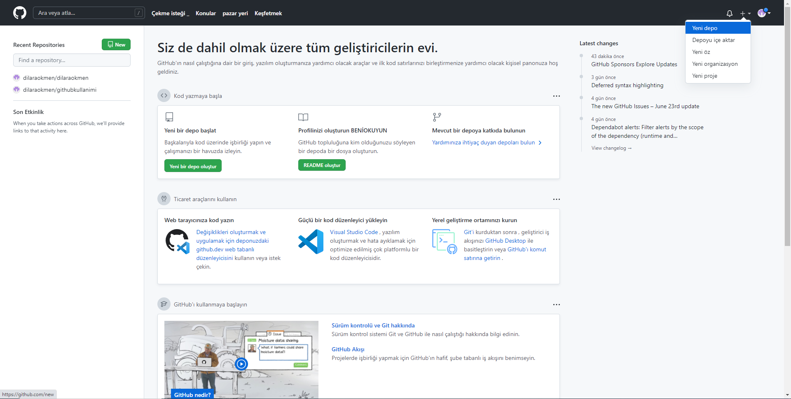

Yeni bir depo oluşturmak için öncelikle depo adı verilir.Açıklama isteğe bağlı yapılabilir.Herkese açık veya özel olup olmadığı seçilir.README.md dosyasının projeye  eklenip eklenmeyeceğine karar verilir. Proje şablonu ve lisans seçilir.Depo oluştur butonuna basılarak yeni bir depo oluşturulur.

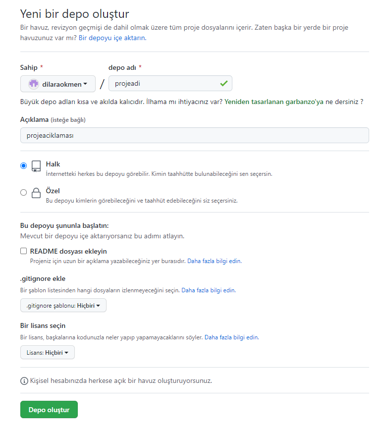

## Github kullanımı
### Dosya yükleme

Konsola aşağıdaki kodlar yazılarak dosya yükleme yapılabilir.
```
git init  (içinde bulunduğumuz dizini Github ile uyumlu hale getirir)
git add .  (tüm dosyaları seçer)
git commit -m "first commit"  (yüklenecek dosyalara yorum ekler)
git branch -M main  (hangi branch'a yükleneceği seçilir)
git remote add origin https://github.com/dilaraokmen/dilaraokmen.git  (hangi projeye yükleneceği seçilir)
git push -u origin main  (seçilen dosyalar gönderilir)
```
veya <br>

Add file butonuna tıkladıktan sonra Upload file butonuna tıklanır ve dosya yükleme ekranına gidilir.

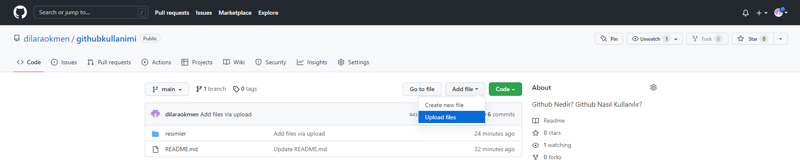

Dosya yükleme ekranına geldikten sonra sürükleme alanına tıklanıp dosyalar seçilebilir. Veya dosyalar sürükle bırak metoduyla eklenebilir. Dosyalar eklendikten sonra isteğe bağlı olarak yorum yazılır ve Commit Changes butonuna tıklanarak yükleme tamamlanır.

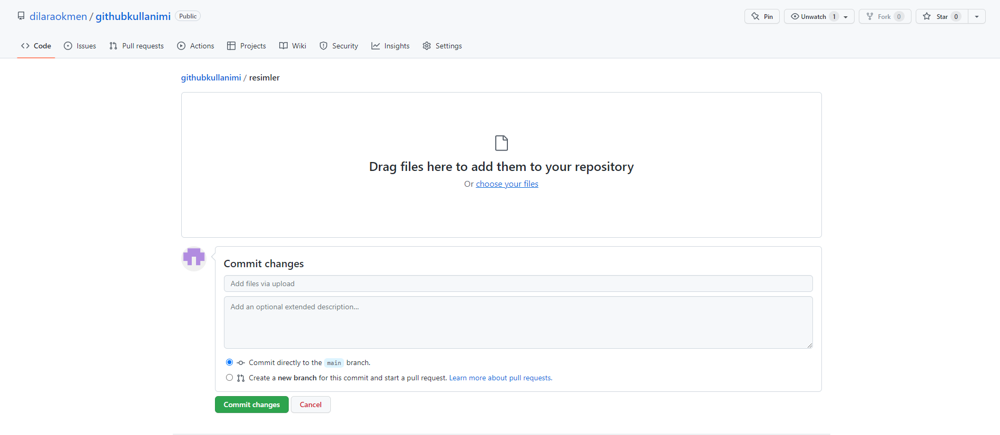

### Dosya düzenleme
Konsolda güncelleme

```
git add .  (yazıyoruz. Böylelikle repositori ye ekleme yapıyoruz.)
git commit -m “ikinci gönderme”  (yorum eklenir)
git push -u origin master (bu komutu yazdıktan sonra sayfayı yenileyip ekleme yaptığınız dosya gelmiş mi diye kontrol edebiliriz.)
```

veya <br>

Projeye girildikten sonra değiştirilmek istenen dosya seçilir ve dosya içeriğinin sağ üstünde bulunan düzenle butonuna tıklanır.

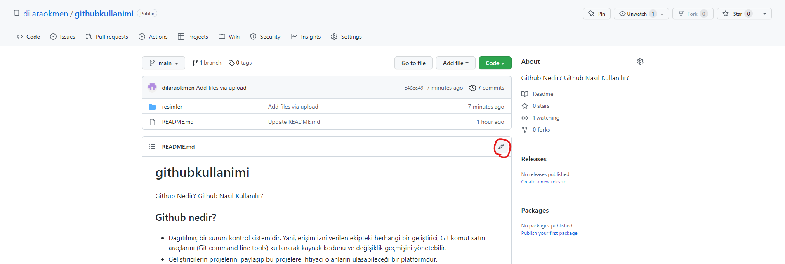

Gerekli değişiklikler yapıldıktan sonra isteğe bağlı yorum eklenir ve Commit changes butonuna tıklanarak değişiklik tamamlanır.

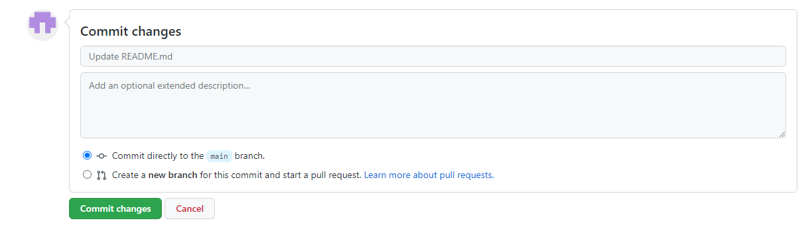

### Projeyi silme

Ayarlar butonuna tıklanarak projenin ayarlar bölümüne gideriz.

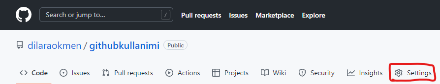

Daha sonra en altta bulunan 'Delete this project' butyonuna tıklanır.

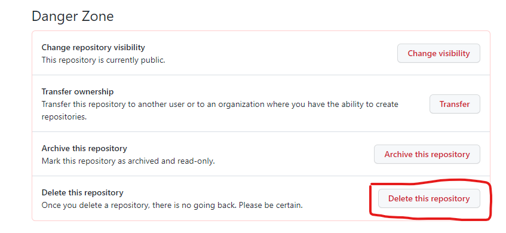

Silmek istediğinizden emin misiniz bölümünden bize yazmamızı istediği metni ilgili bölüme yazarız ve kırmızı renkli metni olan butona tklarız ve kimlik doğrulaması için şifremizi girerek projeyi sileriz.

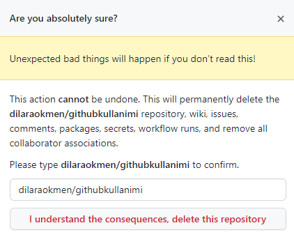

### Projede yapılan değişiklikleri görme
Proje dosyalarının sağ üstünde bulunan commits butonuna tıklanarak daha önce yapılan değişiklikler listelenir.

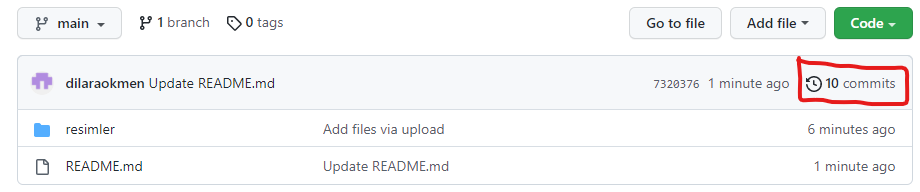

listelenen değişikliklerden herhangi birini seçerek ayrıntıları görebiliriz.

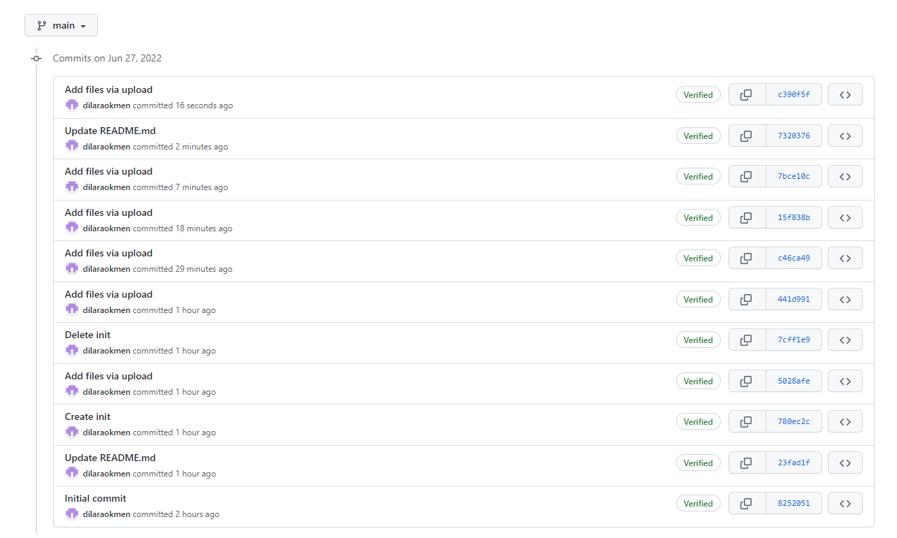
